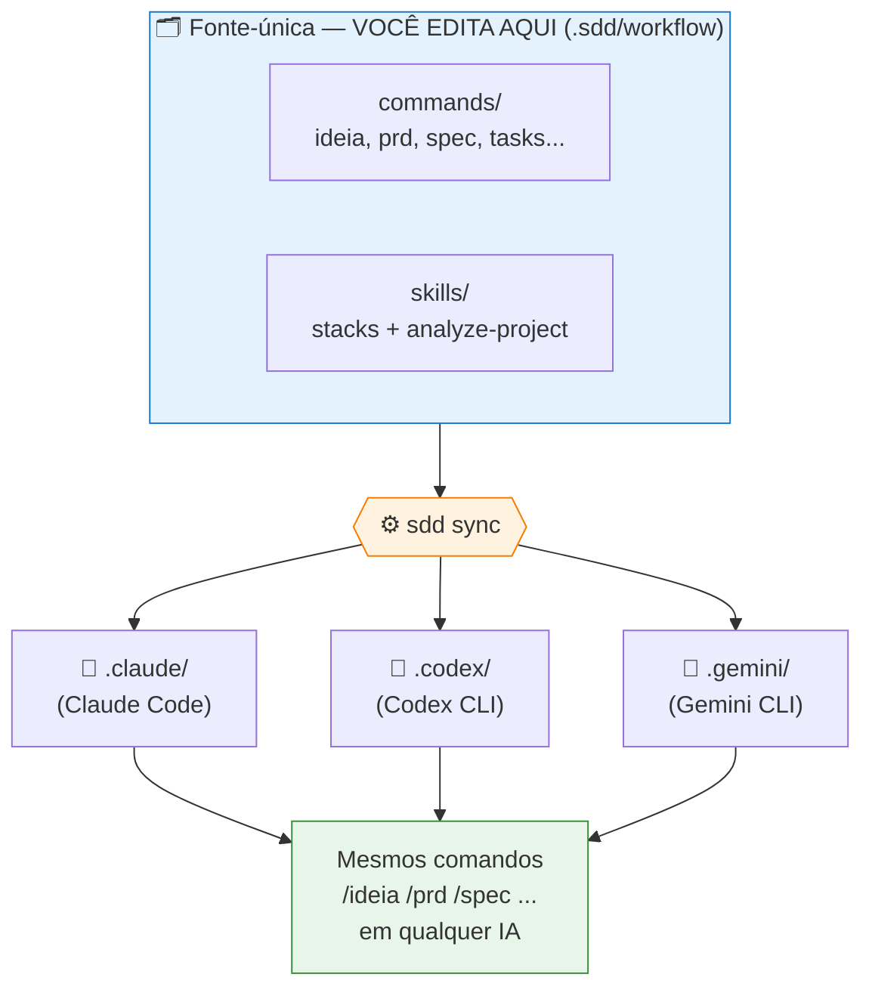
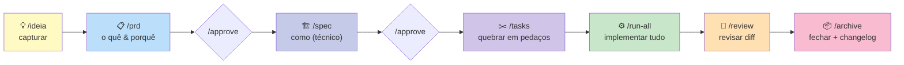
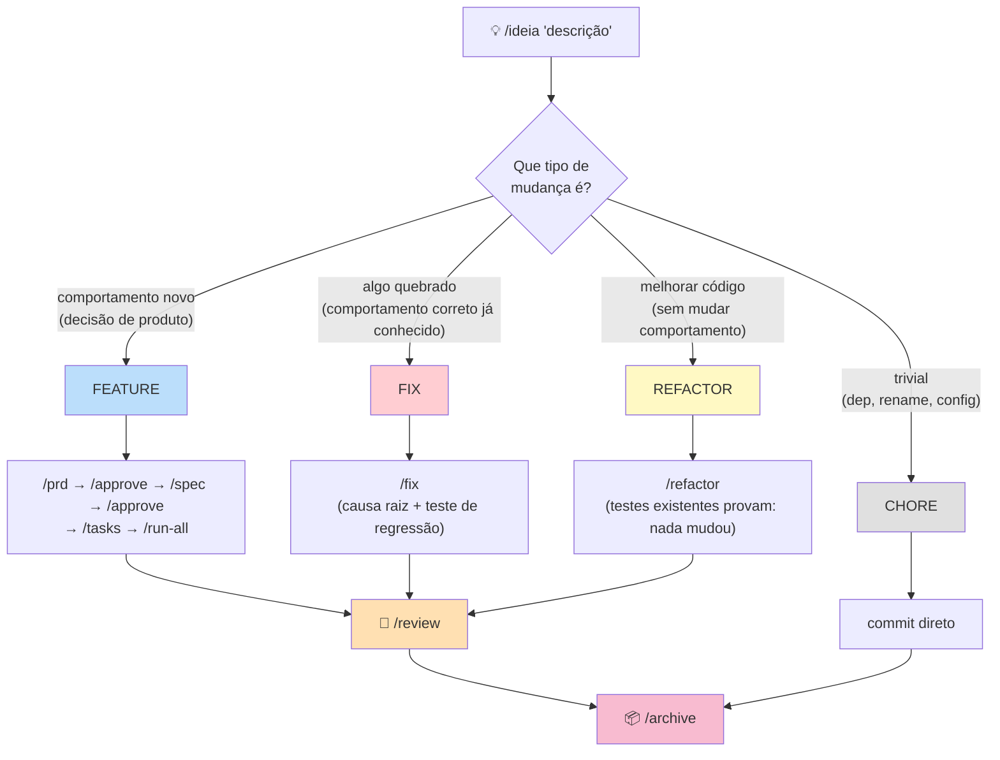
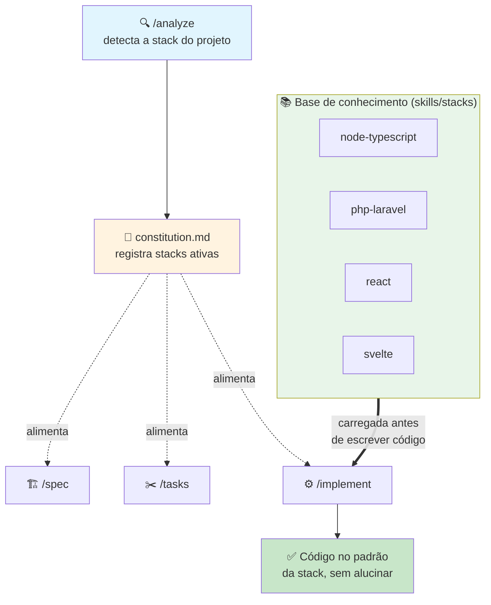
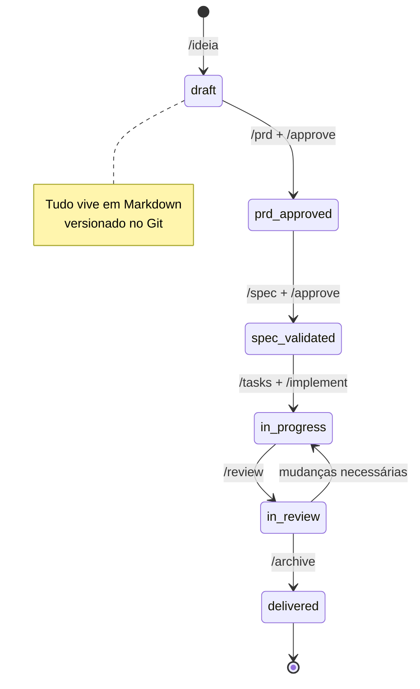
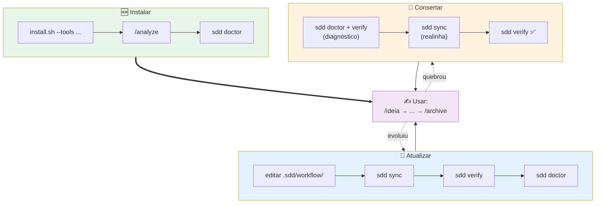
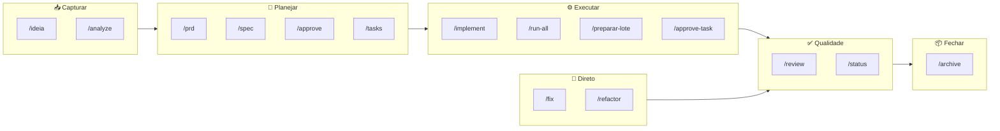

# SDD Workflow — Diagramas para Apresentação

Diagramas em **Mermaid** (renderizam no GitHub, Notion, VS Code, slides com plugin Mermaid).
Cada um pode virar um slide.

---

## 1. Visão geral — O conceito fonte-única → adaptadores

---

## 2. Pipeline principal — O ciclo de uma FEATURE

---

## 3. Os 3 caminhos — Feature vs Fix vs Refactor

O `/ideia` classifica e manda para o caminho certo (pela quantidade de decisões).

---

## 4. Onde a SKILL de stack entra (anti-alucinação)

---

## 5. Estados de uma "change" (máquina de estados)

---

## 6. Ciclo de vida da governança (instalar / atualizar / consertar)

---

## 7. Tabela de comandos (referência rápida — bom como slide-resumo)

